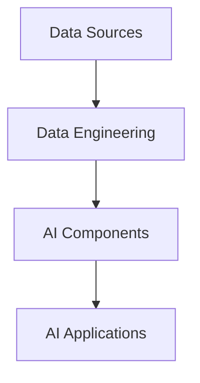

# Development Guide

This guide will help you understand the project structure and how to contribute to Learn AI.

## Project Structure

```
learn-ai/
├── assets/
│   ├── css/
│   │   └── global.css      # Global styles and theme
│   ├── js/
│   │   └── chat.js         # Chat widget implementation
│   └── images/             # Project images and screenshots
├── docs/                   # Documentation
├── index.html             # Main landing page
├── data-sources.html      # Data sources tutorial
├── data-engineering.html  # Data engineering tutorial
├── ai-components.html     # AI components tutorial
├── ai-applications.html   # AI applications tutorial
└── architecture-flow.html # Architecture visualization
```

## Key Components

### Chat Widget

The chat widget is implemented in `assets/js/chat.js` and styled in `assets/css/global.css`. Key features:

- Real-time communication with Ollama
- Context-aware responses
- Rich text formatting
- Message history
- Responsive design

### Architecture Diagrams

The architecture diagrams are created using Mermaid.js. Example:



## Development Setup

1. Install dependencies:
```bash
npm install
```

2. Start development server:
```bash
npm run dev
```

3. Start Ollama:
```bash
ollama run qwen3:1.7b
```

## Adding New Features

### 1. Adding a New Page

1. Create a new HTML file using the template:
```html
<!DOCTYPE html>
<html lang="en">
<head>
    <meta charset="UTF-8">
    <meta name="viewport" content="width=device-width, initial-scale=1.0">
    <title>New Page - Learn AI</title>
    <link rel="stylesheet" href="assets/css/global.css">
</head>
<body>
    <!-- Add your content here -->
    <script src="assets/js/chat.js"></script>
</body>
</html>
```

2. Add navigation link in all pages:
```html
<nav>
    <a href="new-page.html">New Page</a>
</nav>
```

### 2. Modifying the Chat Widget

The chat widget can be customized in `chat.js`:

```javascript
class ChatWidget {
    constructor() {
        // Add new features here
    }
}
```

### 3. Adding New Styles

Add new styles in `global.css`:

```css
.new-feature {
    /* Add your styles here */
}
```

## Best Practices

### Code Style

- Use consistent indentation (4 spaces)
- Follow JavaScript best practices
- Write clean, documented code
- Use meaningful variable names

### Git Workflow

1. Create a new branch:
```bash
git checkout -b feature/new-feature
```

2. Make your changes

3. Commit with a descriptive message:
```bash
git commit -m "Add new feature: description"
```

4. Push to your branch:
```bash
git push origin feature/new-feature
```

5. Create a pull request

### Testing

1. Test on multiple browsers
2. Verify responsive design
3. Check accessibility
4. Test chat functionality
5. Verify theme switching

## Documentation

### Adding Documentation

1. Create new markdown files in `docs/`
2. Update README.md if needed
3. Add comments to code
4. Update diagrams

### Code Comments

```javascript
/**
 * Function description
 * @param {string} param1 - Parameter description
 * @returns {string} Return value description
 */
function example(param1) {
    // Implementation
}
```

## Performance Optimization

1. Optimize images
2. Minify CSS and JavaScript
3. Use lazy loading
4. Implement caching
5. Monitor API calls

## Security

1. Validate user input
2. Sanitize HTML output
3. Implement rate limiting
4. Use HTTPS
5. Follow security best practices

## Deployment

### Local Testing

```bash
python -m http.server 8000
```

### Production

1. Build the project:
```bash
npm run build
```

2. Deploy to your server

3. Configure SSL/TLS

4. Set up monitoring

## Contributing

1. Fork the repository
2. Create a feature branch
3. Make your changes
4. Test thoroughly
5. Submit a pull request

## Support

For help:
- Check the documentation
- Open an issue
- Contact maintainers
- Join the community

## License

This project is licensed under the MIT License. See [LICENSE](LICENSE) for details. 