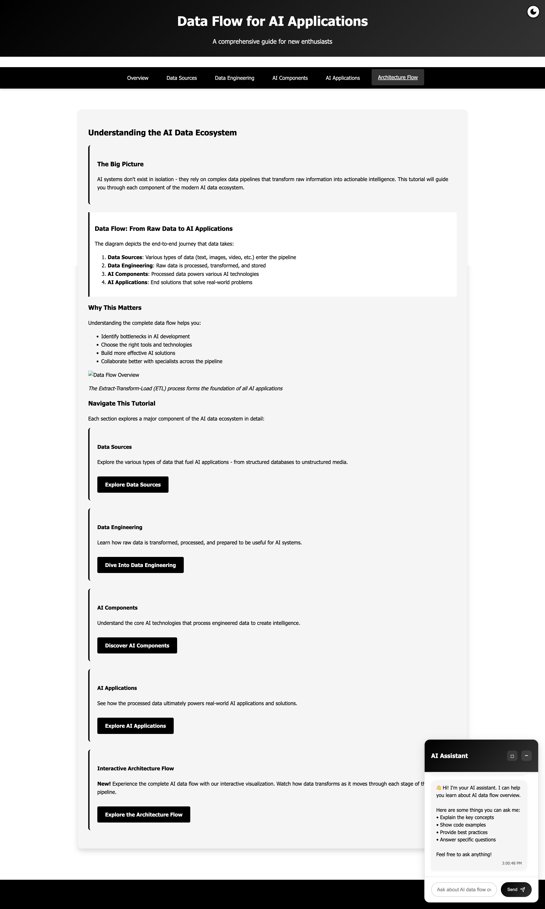
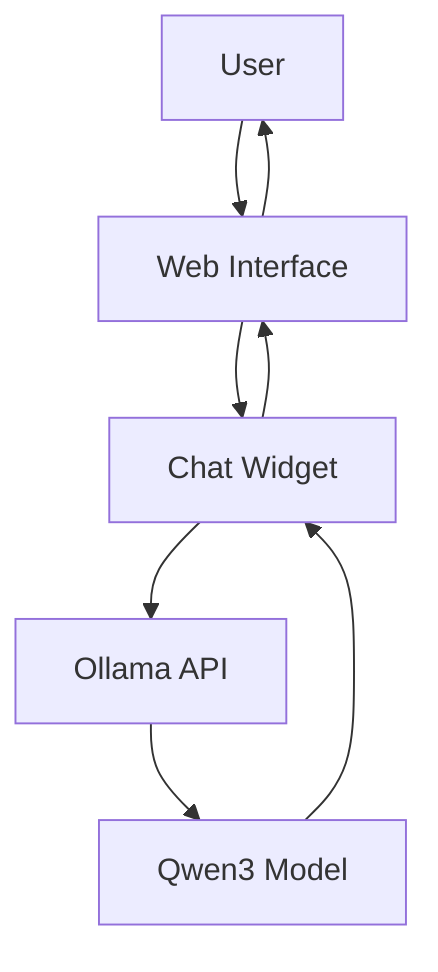
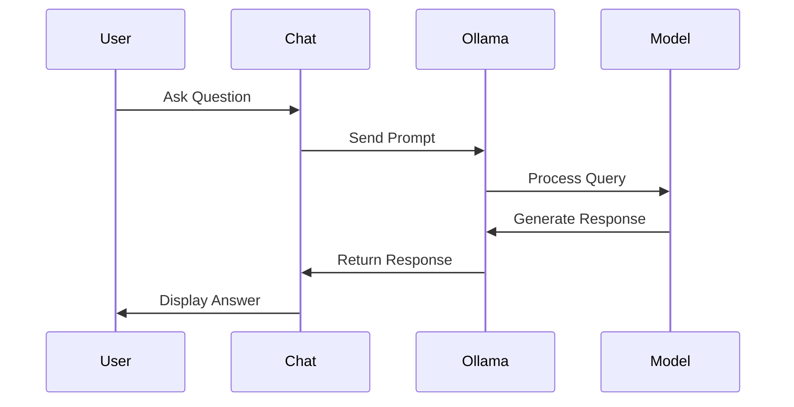
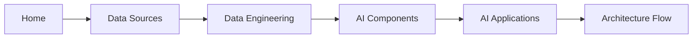

# Learn AI 🌟

An interactive tutorial website that helps users understand AI concepts through an engaging and intuitive interface. Built with modern web technologies and powered by Ollama's Qwen3 model for real-time AI assistance.



## ✨ Features

- 📚 Comprehensive AI tutorials
- 🤖 Interactive AI chat assistant powered by Ollama
- 🎨 Beautiful, responsive design
- 🌓 Light/Dark theme support
- 📱 Mobile-friendly interface
- 🔄 Real-time chat with context awareness
- 📊 Interactive architecture diagrams
- 💡 Rich text formatting in chat responses

## 🚀 Quick Start

### Prerequisites

- Node.js (v14 or higher)
- Ollama installed with Qwen3 model
- Modern web browser

### Installation

1. Clone the repository:
```bash
git clone https://github.com/yourusername/learn-ai.git
cd learn-ai
```

2. Start Ollama with Qwen3 model:
```bash
ollama run qwen3:1.7b
```

3. Serve the website:
```bash
# Using Python's built-in server
python -m http.server 8000

# Or using Node's http-server
npx http-server
```

4. Open your browser and visit:
```
http://localhost:8000
```

## 🏗️ Architecture

### System Overview



### Data Flow



## 📱 Interactive Features

### Chat Widget

The interactive chat widget provides real-time assistance with:

- Context-aware responses
- Rich text formatting
- Code examples
- Best practices
- Architecture explanations


### Architecture Flow

Interactive architecture diagrams showing:

- Data flow between components
- System interactions
- Best practices
- Implementation details


## 🎨 UI Components

### Navigation



### Theme Support

The application supports both light and dark themes:


## 🔧 Development

### Project Structure

```
learn-ai/
├── assets/
│   ├── css/
│   │   └── global.css
│   ├── js/
│   │   └── chat.js
│   └── images/
├── index.html
├── data-sources.html
├── data-engineering.html
├── ai-components.html
├── ai-applications.html
└── architecture-flow.html
```

### Key Technologies

- HTML5 & CSS3
- JavaScript (ES6+)
- Ollama API
- Mermaid.js for diagrams
- Custom chat widget

## 🤝 Contributing

1. Fork the repository
2. Create your feature branch (`git checkout -b feature/AmazingFeature`)
3. Commit your changes (`git commit -m 'Add some AmazingFeature'`)
4. Push to the branch (`git push origin feature/AmazingFeature`)
5. Open a Pull Request

## 📝 License

This project is licensed under the MIT License - see the [LICENSE](LICENSE) file for details.

## 🙏 Acknowledgments

- Ollama team for the amazing AI model
- Mermaid.js for beautiful diagrams
- All contributors and users

## 📞 Support

For support, please:
1. Check the [documentation](docs/)
2. Open an issue
3. Contact the maintainers

---

Made with ❤️ by [Your Name]